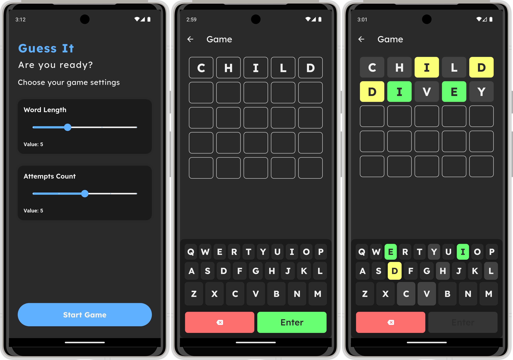
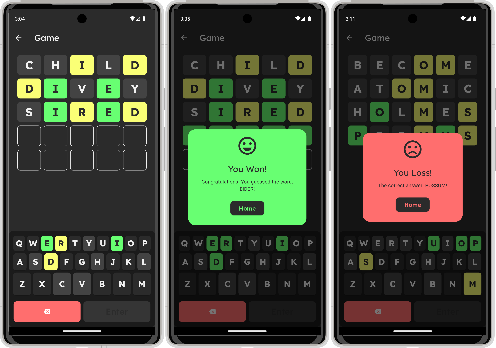

# flutter_guess_it

 
 

# Built With 

- [Flutter&Dart](https://docs.flutter.dev/get-started/codelab)
- [Basic Widgets](https://docs.flutter.dev/ui/widgets/basics)
- [Material Component Widgets](https://docs.flutter.dev/ui/widgets/material)
- [Async Widgets](https://docs.flutter.dev/ui/widgets/async)
- [Flutter Bloc](https://pub.dev/packages/flutter_bloc)
- [Go Router](https://pub.dev/packages/go_router)
- [Dio](https://pub.dev/packages/dio)
- [Pretty Dio Logger](https://pub.dev/packages/pretty_dio_logger)
- [Get It](https://pub.dev/packages/get_it)
